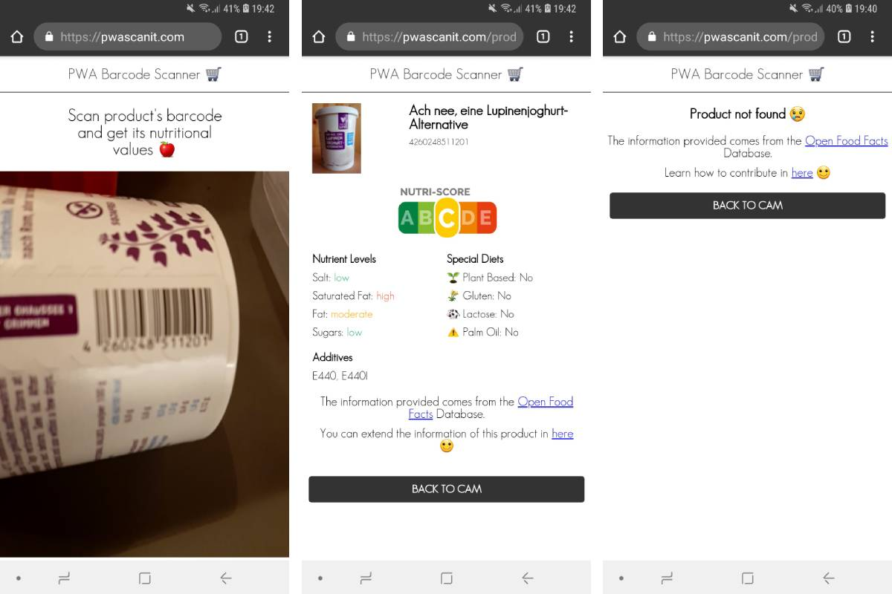

[](https://app.netlify.com/sites/stoic-easley-8962cb/deploys)

# PWA Barcode Scanner 🛒

Scan product's barcode and get its nutritional values 🍎

# Demo

## See it live

[https://pwascanit.com/](https://pwascanit.com/)

## Gif


# Screenshots



# Clone the Repository

```bash
git clone https://github.com/moigonzalez/pwa-barcode-scanner.git
```

# Installation

```bash
npm install
```

# Development

```bash
npm run dev
```

# Contributing

Please see our [contributing.md](https://github.com/moigonzalez/pwa-barcode-scanner/blob/master/contributing.md)


# Open Food Facts

All the information comes from [Open Food Facts](https://world.openfoodfacts.org/discover) Database.

Free and open database of food products from around the world!
